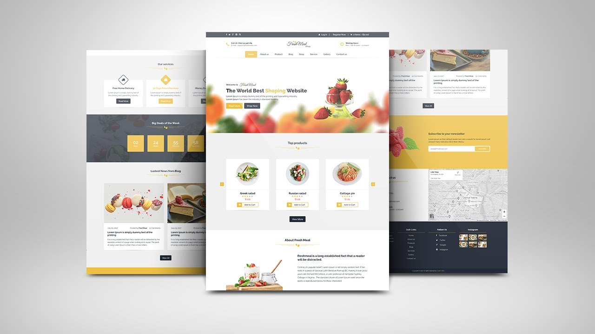

<div align="center">
  
  <h2 align="center">Fresh Meal Shop - Restaurant Website</h2>

</br>Responsive for all devices, built using HTML, CSS, Javascript and Css

  <a href="https://fresh-meal-shop.vercel.app/"><strong>➥ Live Demo</strong></a>

</div>

<br />

### Demo Screeshots



### Prerequisites

Before you begin, ensure you have met the following requirements:

* [Git](https://git-scm.com/downloads "Download Git") must be installed on your operating system.

### Run Locally

To run **Foodman** locally, run this command on your git bash:

Linux and macOS:

```bash
sudo git clone https://github.com/odutolaisreal/Fresh-Meal-Shop.git
```

Windows:

```bash
git clone https://github.com/odutolaisreal/Fresh-Meal-Shop.git
```

### Contact

If you want to contact with me you can reach me at [Whatsapp](https://wa.me/+2347060529706).

# Fresh-Meal-Shop
